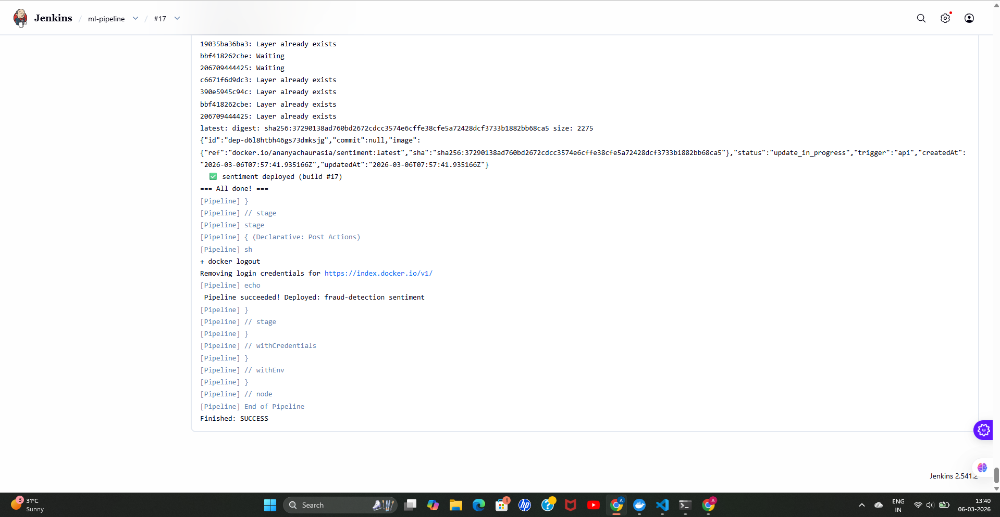
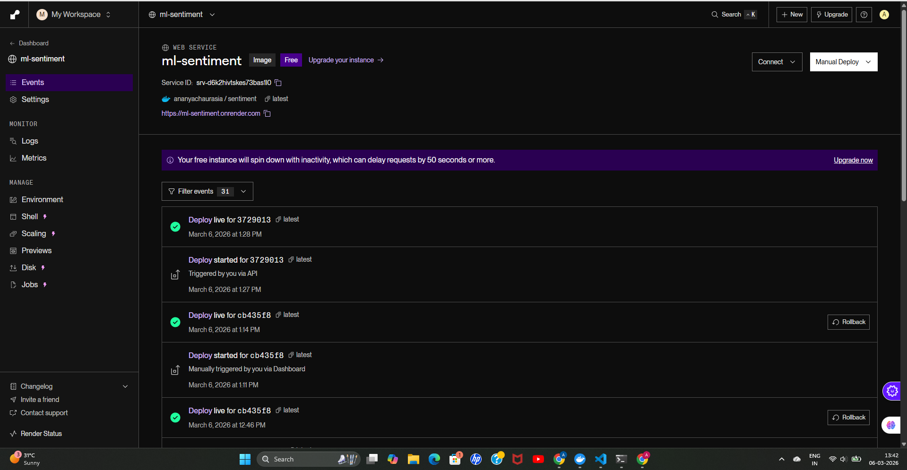
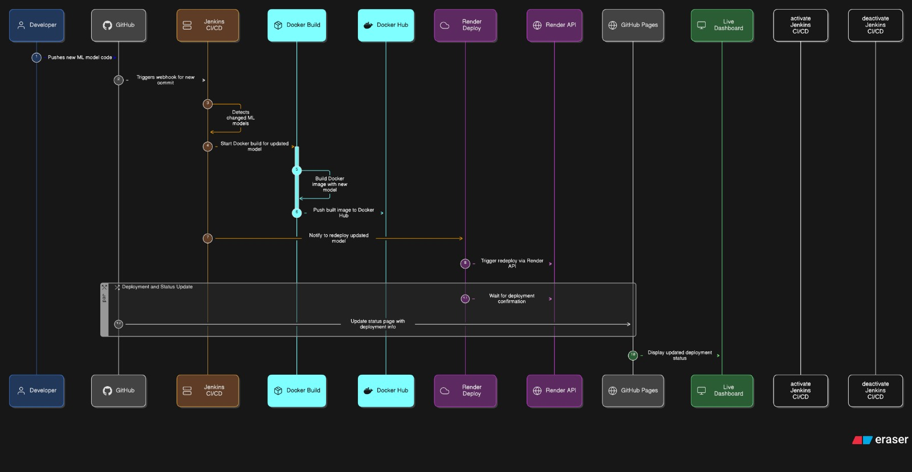

# 🤖 ML Hub — Automated MLOps Pipeline


> Push a model. Watch it deploy. That's it.

An end-to-end MLOps pipeline that automatically builds, containerizes, and deploys machine learning models whenever code is pushed to GitHub. No manual steps. No SSH. Just `git push`.

---

## 📸 Screenshots

### Dashboard
<!-- Add a screenshot of your dashboard homepage here -->


### Pipeline Running in Jenkins
<!-- Add a screenshot of a successful Jenkins build here -->


### Model Prediction in Action
<!-- Add a screenshot of a prediction result on the dashboard here -->


### Render Deployment
<!-- Add a screenshot of your Render services page here -->


---

## ✨ What It Does

Every time you push changes to `models/`, the pipeline:

1. **Detects** which model changed
2. **Builds** a Docker image for that model
3. **Pushes** it to Docker Hub
4. **Deploys** it to Render automatically via API
5. **Updates** the live dashboard on GitHub Pages

Zero manual intervention required.

---

## 🏗️ Architecture

<!-- Add a diagram or screenshot of your architecture here -->


---

## 🚀 Deployed Models

| Model | Endpoint | Status |
|-------|----------|--------|
| Sentiment Analysis | `https://ml-sentiment.onrender.com` | 🟢 Live |
| Fraud Detection | `https://fraud-detection-latest-h1ro.onrender.com` | 🟢 Live |

> **Note:** Free tier on Render spins down after 15 min of inactivity. First request may take ~30 seconds to wake up.

---

## 🛠️ Tech Stack

| Layer | Technology |
|-------|-----------|
| CI/CD | Jenkins |
| Containerization | Docker + Docker Hub |
| Hosting | Render (free tier) |
| Frontend | GitHub Pages |
| ML Framework | Scikit-Learn |
| API | Flask + Gunicorn |
| Language | Python 3.11 |

---

## 📁 Project Structure

```
ML-Pipeline/
├── models/
│   ├── sentiment/
│   │   ├── app.py          # Flask API
│   │   ├── train.py        # Model training script
│   │   ├── model.pkl       # Trained model
│   │   ├── requirements.txt
│   │   ├── Dockerfile
│   │   └── tests/
│   │       └── test_app.py
│   └── fraud-detection/
│       ├── app.py
│       ├── train.py
│       ├── model.pkl
│       ├── requirements.txt
│       ├── Dockerfile
│       └── tests/
│           └── test_app.py
├── docs/
│   └── index.html          # GitHub Pages dashboard
├── assets/                 # Screenshots for README
│   ├── dashboard.png
│   ├── jenkins.png
│   ├── prediction.png
│   └── render.png
├── Jenkinsfile             # CI/CD pipeline definition
├── deploy.sh               # Build + push + deploy script
└── README.md
```

---

## ⚡ API Usage

Each deployed model exposes the same REST API:

### Health Check
```bash
GET /health

# Response
{"status": "ok", "model": "sentiment"}
```

### Prediction
```bash
POST /predict
Content-Type: application/json

{"features": [0.9, 0.8, 0.7]}

# Response
{"model": "sentiment", "prediction": [1]}
```

---

## ➕ Adding a New Model

Adding a new ML model to the pipeline takes 3 steps:

### 1. Create the model folder
```
models/your-model-name/
├── app.py          # Flask API (copy from existing model)
├── train.py        # Your training script
├── requirements.txt
└── Dockerfile
```

### 2. Register on Render
- Create a new Web Service on [render.com](https://render.com)
- Set runtime to **Docker Image**
- Copy the Service ID from the URL

### 3. Add to deploy.sh
```bash
MODELS["your-model-name"]="yourdockerhub/your-model-name:SERVICE_ID_HERE"
```

Then add to the dashboard's `RENDER_SERVICES` object in `docs/index.html`.

### 4. Push
```bash
git add .
git commit -m "add your-model-name"
git push
```

Jenkins handles everything else automatically. ✅

---

## 🔧 Local Setup

### Prerequisites
- Docker Desktop
- Jenkins (running in Docker)
- ngrok (for GitHub webhook tunneling)

### Running Jenkins
```bash
docker run -d \
  --name jenkins \
  -p 8080:8080 \
  -v jenkins_home:/var/jenkins_home \
  -v /var/run/docker.sock:/var/run/docker.sock \
  jenkins/jenkins:lts
```

### After Laptop Restart
Docker socket permissions reset on restart. Fix with:
```bash
docker exec -it --user root jenkins bash -c "chmod 666 /var/run/docker.sock"
```

Start ngrok tunnel (needed for GitHub webhooks):
```bash
ngrok http 8080
```

### Training Models Locally
```bash
cd models/sentiment
python train.py

cd models/fraud-detection
python train.py
```

---

## 🔑 Jenkins Credentials Required

| Credential ID | Type | Description |
|--------------|------|-------------|
| `github-token` | Username/Password | GitHub personal access token |
| `DOCKER_CREDS` | Username/Password | Docker Hub credentials |
| `RENDER_API_KEY` | Secret Text | Render API key |

---

